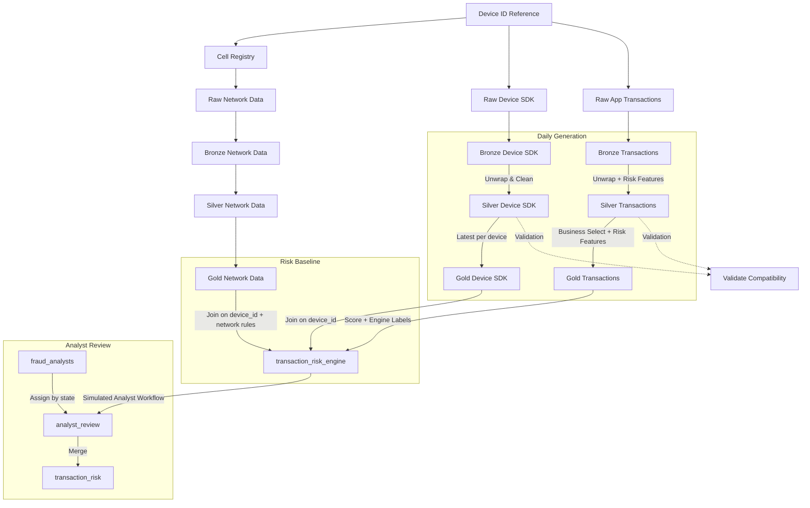

# Pipeline Details

Comprehensive documentation for the Telecom Fraud Detection Data Pipeline implementation.

**Blueprint layout**: Pipeline scripts live under `notebooks/`. The bundle job in `databricks.yml` runs them with `./notebooks/<script>.py`.

## Table of Contents
- [Pipeline Flow](#pipeline-flow)
- [Data Architecture](#data-architecture)
- [Tables and Schemas](#tables-and-schemas)
- [Fraud Detection Logic](#fraud-detection-logic)
- [Task Dependencies](#task-dependencies)
- [Usage Examples](#usage-examples)

---

## Pipeline Flow



### Pipeline Stages

0. **Device ID Reference**: Generate master list of device IDs (no dependencies)
1. **Cell Registry**: `generate_cell_registry.main()` creates synthetic base station/cell lookup (lac, cell_id, bs_lat, bs_lon, coverage, country/region/city) for network geo resolution
2. **Raw Device SDK Generation**: `generate_raw_device_sdk.main()` generates raw device profiles and writes JSON Lines (NDJSON) to `/Volumes/{catalog}/{schema}/raw_device_sdk/`, partitioned by yyyy/mm/dd
3. **Device SDK Bronze Ingestion**: `generate_bronze_device_sdk.main()` reads from the raw volume and creates the bronze layer; silver unwraps
4. **Raw Transaction Generation**: `generate_raw_app_transactions.main()` generates raw unstructured data and writes JSON Lines (NDJSON) to `/Volumes/{catalog}/{schema}/raw_app_transactions/`, partitioned by yyyy/mm/dd
5. **Transaction Bronze Ingestion**: `generate_bronze_app_transactions.main()` reads from the raw volume and creates the bronze layer, followed by silver → gold
6. **Raw Network Data Generation**: `generate_raw_network_data.main()` generates CDR-like network events (uses device_id_reference and cell_registry), writes to `/Volumes/{catalog}/{schema}/raw_network_data/`, partitioned by yyyy/mm/dd
7. **Network Bronze/Silver/Gold**: `generate_bronze_network_data.main()` ingests from Volume; `generate_silver_network_data.main()` unpacks report and joins cell_registry for geo; `generate_gold_network_data.main()` produces risk-ready `gold_network_data`
8. **Risk Baseline**: `risk_engine.main()` loads `gold_app_transactions`, `gold_device_sdk`, and `gold_network_data`; joins on `subscriber_device_id`; computes network rule features (impossible travel, cell–IP mismatch, rapid cell hop, roaming anomaly); scores using transaction, device, and network rules; stores engine outputs in `transaction_risk_engine`
9. **Fraud Analyst Roster**: `generate_fraud_analysts.main()` creates `fraud_analysts` (same number of analysts per state) so workload imbalance by state is visible (cases per analyst).
10. **Analyst Review**: `run_analyst_simulation.main()` loads `fraud_analysts`, assigns an analyst to every transaction by state (round-robin), then simulates review; all cases (Pending review, Blocked, Passed) have an assigned analyst; produces `analyst_review` and the final `transaction_risk` table
11. **Validation**: Confirms shared device IDs between pipelines

---

## Data Architecture

The pipeline implements a **medallion architecture** with progressive data refinement:

### Bronze Layer
**Purpose**: Raw data landing with JSON blobs for schema flexibility

**Characteristics**:
- Preserves original data structure
- JSON-wrapped reports for extensibility
- Minimal transformations
- Full audit trail

**Tables**:
- `bronze_device_sdk`: Raw device profiles (ingested from Volume)
- `bronze_app_transactions`: Raw transaction events (ingested from Volume)
- `bronze_network_data`: Raw network (CDR-like) events; key columns + report JSON (ingested from Volume)

**Volumes** (Raw Unstructured Data):
- `/Volumes/{catalog}/{schema}/raw_device_sdk/`: JSON Lines (NDJSON) device profiles, partitioned by yyyy/mm/dd
- `/Volumes/{catalog}/{schema}/raw_app_transactions/`: JSON Lines (NDJSON) transactions, partitioned by yyyy/mm/dd
- `/Volumes/{catalog}/{schema}/raw_network_data/`: JSON Lines (NDJSON) CDR-like network events, partitioned by yyyy/mm/dd

### Silver Layer
**Purpose**: Cleaned data with risk features and business transformations

**Characteristics**:
- Unwrapped JSON structures
- 35+ risk features
- Data quality improvements
- Subscriber location context (lat/long)
- Type conversions and standardization

**Tables**:
- `silver_device_sdk`: Cleaned device data (50+ attributes)
- `silver_app_transactions`: Cleaned transactions with risk features
- `silver_network_data`: Cleaned network events with cell→geo join (geo_lat_est, geo_lon_est, geo_country/region/city from cell_registry)

### Gold Layer
**Purpose**: Business-ready data optimized for analytics and risk scoring

**Characteristics**:
- Business-focused columns
- Risk features included (NO fraud labels)
- Optimized for reporting and analytics
- Subscriber location context preserved
- One row per device in `gold_device_sdk` (latest snapshot)

**Tables**:
- `gold_app_transactions`: Business-ready transaction data
- `gold_device_sdk`: Business-ready device data (one row per device); used by the risk engine for device-based risk signals
- `gold_network_data`: Business-ready network (CDR-like) events; used by the risk engine for network rules (impossible travel, cell–IP mismatch, rapid cell hop, roaming)

**Reference Tables**:
- `cell_registry`: Base station/cell lookup (cell_id, lac, bs_lat, bs_lon, nominal_radius_m, env_type, country, region, city) for resolving network event location

### Risk Layer
**Purpose**: Independent fraud scoring and case management

**Characteristics**:
- Fraud scores (0-100)
- Engine-level fraud labels
- Case status and management
- Analyst review outcomes
- Mitigation actions

**Tables**:
- `transaction_risk_engine`: Engine baseline scores and labels
- `analyst_review`: Analyst outcomes and notes
- `transaction_risk`: Final merged fraud decisions

---

## Tables and Schemas

### 1. device_id_reference
**Purpose**: Master list of device IDs for cross-pipeline consistency

| Column | Type | Description |
|--------|------|-------------|
| `device_id` | string | Unique device identifier (format: `device_NNNNNN`) |

**Records**: 10,000

---

### 2. cell_registry
**Purpose**: Base station / cell lookup for network pipeline geo resolution

| Column | Type | Description |
|--------|------|-------------|
| `base_station_id` | string | Logical base station ID |
| `lac` | int | Location area code |
| `cell_id` | string | Cell identifier (e.g. cell_NNNNNN) |
| `sector_id` | string | Sector (alpha/beta/gamma) |
| `bs_lat`, `bs_lon` | float | Base station coordinates |
| `sector_azimuth_deg`, `sector_beamwidth_deg` | int | Antenna parameters |
| `env_type` | string | urban, suburban, rural |
| `nominal_radius_m` | int | Typical coverage radius (m) |
| `country`, `region`, `city` | string | Geographic labels |

**Records**: 5,000 (synthetic US cells)

---

### 3. bronze_device_sdk
**Purpose**: Raw device profiling data

| Column | Type | Description |
|--------|------|-------------|
| `device_id` | string | Device identifier |
| `query_timestamp` | timestamp | Data collection timestamp |
| `report` | string (JSON) | Device profile in JSON format |

**Records**: 10,000

**JSON Report Schema** (50+ attributes):
- Device specs: RAM, storage, battery, screen size
- Network: carrier, connection type, roaming status
- Security: device trust score, MFA status, biometric enabled
- Usage: app permissions, location services
- Hardware: manufacturer, model, OS version

---

### 4. silver_device_sdk
**Purpose**: Cleaned device data with unpacked attributes

**Schema**: 50+ columns including:
- `subscriber_device_id`: Device identifier
- `query_timestamp`: Collection timestamp
- `device_ram_gb`: RAM in gigabytes
- `device_storage_gb`: Storage capacity
- `battery_capacity_mah`: Battery capacity
- `device_trust_score`: Security score (0-100)
- `mfa_enabled`: Multi-factor authentication status
- `biometric_enabled`: Biometric authentication status
- `subscriber_location_lat/long`: Geographic coordinates
- And 40+ more device attributes

**Records**: 10,000

---

### 5. bronze_app_transactions
**Purpose**: Raw transaction events

| Column | Type | Description |
|--------|------|-------------|
| `transaction_id` | string | Unique transaction identifier |
| `device_id` | string | Device identifier |
| `transaction_timestamp` | timestamp | Transaction time |
| `report` | string (JSON) | Transaction details in JSON format |

**Records**: 100,000

**JSON Report Schema**:
- Transaction details: amount, currency, merchant
- User context: account age, login method
- Security events: SIM swap, password reset, MFA anomalies
- Behavioral patterns: geo velocity, after-hours activity
- Device context: new device flag, trust scores

---

### 6. silver_app_transactions
**Purpose**: Cleaned transactions with 35+ risk features

**Key Columns**:
- Transaction identifiers and basic info
- Risk indicators (binary flags):
  - `sim_swap_flag`: Recent SIM swap detected
  - `dark_web_breach_flag`: Credentials in breach database
  - `geo_anomaly_flag`: Unusual geographic location
  - `high_geo_velocity_flag`: Rapid location changes
  - `high_value_transaction_flag`: Above threshold amount
  - `login_failure_flag`: Recent failed logins
  - `no_mfa_flag`: MFA not enabled
  - `new_device_flag`: First transaction from device
  - `password_reset_flag`: Recent password reset
  - `after_hours_flag`: Transaction outside business hours
- Risk scores:
  - `mfa_anomaly_score`: MFA behavior anomaly (0-100)
  - `profile_change_count`: Recent profile modifications
  - `device_trust_score`: Device security score (0-100)
- Location context:
  - `subscriber_location_lat/long`: Transaction location

**Records**: 100,000

---

### 7. gold_app_transactions
**Purpose**: Business-ready transaction data

**Characteristics**:
- Subset of silver layer columns
- Risk features included
- NO fraud labels (clean business data)
- Optimized for analytics and reporting
- Subscriber location preserved

**Records**: 100,000

---

### 8. gold_device_sdk
**Purpose**: Business-ready device data (one row per device) for risk engine and analytics

**Characteristics**:
- One row per `subscriber_device_id` (latest `query_timestamp` per device)
- Risk-relevant device attributes: encryption, VPN, SELinux, model, OS version, RAM, etc.
- Used by the risk engine for device-based scoring (VPN, unencrypted, emulator, SELinux disabled)

**Key Columns** (among others): `subscriber_device_id`, `query_timestamp`, `subscriber_device_encryption`, `subscriber_vpn_active`, `subscriber_vpn_connected`, `subscriber_selinux_status`, `subscriber_device_model`, `subscriber_os_version`, `subscriber_device_ram`, `subscriber_system_user`

**Records**: 10,000 (one per device)

---

### 9. bronze_network_data
**Purpose**: Raw network (CDR-like) events from Volume

| Column | Type | Description |
|--------|------|-------------|
| `event_id` | string | Unique event identifier |
| `subscriber_device_id` | string | Device (same ID space as device_id_reference) |
| `timestamp_start` | timestamp | Event start (UTC) |
| `report` | string (JSON) | Event details (event_type, cell_id, geo, a/b party, billing, etc.) |

**Records**: ~150,000

---

### 10. silver_network_data
**Purpose**: Cleaned network events with cell→geo resolution

**Key columns**: event_id, subscriber_device_id, timestamp_start/end, duration_sec, event_type, direction, status, cell_id, lac, base_station_id, geo_est_method, geo_lat_est, geo_lon_est, geo_accuracy_m, geo_country, geo_region, geo_city, a_party_id, b_party_id, home_mno_id, visited_mno_id, radio_access_technology, session_id, device_os, device_model, app_channel, client_ip, ip_geo_country, charge_amount, is_roaming, roaming_zone, etc.

**Records**: ~150,000

---

### 11. gold_network_data
**Purpose**: Business/risk-ready network events for risk engine

**Characteristics**: Subset of silver columns; one row per event; includes subscriber_device_id for joining to transactions and device SDK. Used by the risk engine to compute per-device network rule flags (impossible travel, cell–IP mismatch, rapid cell hop, roaming anomaly).

**Records**: ~150,000

---

### 12. transaction_risk_engine
**Purpose**: Engine-generated fraud scoring and case management

**Key Columns**:
- `transaction_id`: Transaction identifier
- `fraud_score`: Calculated risk score (0-100)
- `fraud_label_engine`: Engine fraud determination (0/1)
- `risk_reason_engine`: Primary risk indicator
- `case_status`: Case classification (blocked/reviewed/escalated/pending/safe)
- `analyst_assigned`: Analyst name (for reviewed cases)
- `root_cause`: Fraud root cause category
- `mitigation_action`: Action taken (account lockout, velocity limit, etc.)
- `review_timestamp`: When case was reviewed

**Records**: 100,000

**Case Status Distribution**:
- `blocked` (≥95 score): Auto-hold with mitigation
- `reviewed` (70-95 subset): Confirmed by analysts with notes
- `escalated` (70-95 subset): Awaiting SME review
- `pending` (70-95 subset): Queued, no analyst metadata yet
- `safe` (<70): Cleared without intervention

---

### 12b. fraud_analysts
**Purpose**: Roster of fraud analysts by state (same count per state for workload imbalance visibility)

**Key Columns**:
- `analyst_id`: Unique analyst identifier (e.g. a_CA_0)
- `analyst_name`: Analyst full name
- `state`: US state (analyst location)
- `region`: Region (WEST, EAST, SOUTH, NORTH, CENTER)

**Records**: (analysts_per_state × number of states); used to assign every transaction an analyst in the same state and to compute cases-per-analyst by state for "need support" dashboards.

---

### 13. analyst_review
**Purpose**: Simulated analyst review outcomes; every transaction has an assigned analyst (by state)

**Key Columns**:
- `transaction_id`: Transaction identifier
- `review_status`: Outcome (reviewed, escalated, pending_review)
- `assigned_analyst_id`, `assigned_analyst`: Analyst for this case (assigned by transaction state, round-robin)
- `analyst_notes`: Review comments
- `is_fp`, `is_fn`: False positive / false negative flags
- `last_review_date`, `mitigation_steps`: When applicable

**Records**: One per transaction (all cases have an assigned analyst)

---

### 14. transaction_risk
**Purpose**: Final fraud decisions merging engine and analyst outcomes

**Characteristics**:
- Combines `transaction_risk_engine` with `analyst_review`
- Final fraud determination
- Complete audit trail
- Includes all risk features and analyst metadata

**Records**: 100,000

---

## Fraud Detection Logic

### Risk Scoring Engine

The risk engine calculates fraud scores (0-100) based on **12 risk indicators** with weighted point values:

#### Critical Risk Indicators (15-20 points)
- **SIM Swap** (20 pts): Recent SIM card change
- **Dark Web Breach** (18 pts): Credentials found in breach database
- **Geographic Anomaly** (15 pts): Transaction from unusual location
- **High Geo Velocity** (10 pts): Rapid movement between locations

#### Medium Risk Indicators (8-12 points)
- **High Value Transaction** (12 pts): Amount exceeds threshold
- **Login Failure** (12 pts): Recent failed authentication attempts
- **No MFA** (10 pts): Multi-factor authentication not enabled
- **New Device** (8 pts): First transaction from this device

#### Lower Risk Indicators (5-7 points)
- **Password Reset Activity** (7 pts): Recent password changes
- **After Hours Transaction** (5 pts): Outside normal business hours

#### Dynamic Modifiers
- **MFA Anomaly Score** (×0.15): Unusual MFA behavior patterns
- **Profile Changes** (×3, max 15): Recent account modifications
- **Low Device Trust** (×0.2, max 15): Compromised device indicators

#### Device SDK–Based Indicators (from `gold_device_sdk`)
- **VPN Active** (6 pts): Device VPN is active
- **VPN Connected** (6 pts): Device VPN is connected
- **Unencrypted Device** (10 pts): Device storage not encrypted
- **SELinux Disabled** (10 pts): Security module disabled (e.g. rooted)
- **Emulator** (12 pts): Device model indicates emulator (e.g. "SDK built for x86")

#### Network (CDR) Rule–Based Indicators (from `gold_network_data`)
Computed per device from CDR-like events; joined to transactions on `subscriber_device_id`:
- **Impossible Travel High** (15 pts): Consecutive events with distance > 100 km and implied speed > 1,000 km/h (R1)
- **Impossible Travel Medium** (8 pts): Implied speed between consecutive events > 250 km/h (R2)
- **Cell vs IP Mismatch** (10 pts): Cell country ≠ IP geolocation country (R5)
- **Rapid Cell Hop** (12 pts): Consecutive events > 50 km apart with time delta < 5 min (R7)
- **Roaming Anomaly** (10 pts): Multiple countries in short window while roaming (R13)

The risk engine loads `gold_app_transactions`, `gold_device_sdk`, and `gold_network_data`; joins transaction and device gold on `subscriber_device_id` (left join); computes per-device network rule features from `gold_network_data` and left-joins them to the merged table. Transactions without a matching device or network data are still scored; device and network points apply only when the corresponding data is present.

### Score Distribution & Labeling

**Target Distribution**:
- 10% very high risk (score ≥95)
- 10% high risk (score 70-95)
- 80% low risk (score <70)

**Fraud Rate**: 26.63% (top N transactions by score)

**Case Classification**:
- `blocked` (≥95): Auto-hold with immediate mitigation
  - Account lockout
  - Velocity limits
  - High-risk merchant blocks
  
- `reviewed` (70-95 subset): Confirmed by analysts
  - Detailed notes
  - Root cause identification
  - Mitigation actions
  - False positive tracking
  
- `escalated` (70-95 subset): Awaiting SME/third-party review
  - Complex cases
  - Notes only, no mitigation yet
  
- `pending` (70-95 subset): Queued for review
  - No analyst metadata yet
  
- `safe` (<70): Cleared without intervention
  - No case management needed

### Case Management

When fraud is detected, the engine generates:

1. **Case Status**: Classification based on score and review state
2. **Analyst Assignment**: Random analyst from pool for reviewed cases
3. **Root Cause**: Primary fraud type:
   - Account Takeover
   - Identity Theft
   - Payment Fraud
   - Synthetic Identity
   - First-Party Fraud
4. **Mitigation Action**: Response taken:
   - Account Lockout
   - Transaction Reversal
   - Velocity Limit
   - High-Risk Merchant Block
   - MFA Enforcement
5. **Timestamps**: Case creation and review times

---

## Task Dependencies

### Task 1: Device_ID_Reference
**Script**: `generate_device_id_reference.py`  
**Dependencies**: None  
**Purpose**: Generate master device ID list  
**Output**: `device_id_reference` table

### Task 2: Cell_Registry
**Script**: `generate_cell_registry.py`  
**Dependencies**: Device_ID_Reference  
**Purpose**: Generate synthetic base station/cell lookup for network geo resolution  
**Output**: `cell_registry` table

### Task 3: Raw_Device_SDK
**Script**: `generate_raw_device_sdk.py`  
**Dependencies**: Device_ID_Reference  
**Purpose**: Generate raw device profiles and write to Volume as NDJSON  
**Output**: `/Volumes/{catalog}/{schema}/raw_device_sdk/` (partitioned by date)

### Task 4: Bronze_Device_SDK
**Script**: `generate_bronze_device_sdk.py`  
**Dependencies**: Raw_Device_SDK  
**Purpose**: Read from Volume and create bronze layer  
**Output**: `bronze_device_sdk` table

### Task 5: Raw_App_Transactions
**Script**: `generate_raw_app_transactions.py`  
**Dependencies**: Device_ID_Reference  
**Purpose**: Generate raw transaction data and write to Volume as NDJSON  
**Output**: `/Volumes/{catalog}/{schema}/raw_app_transactions/` (partitioned by date)

### Task 6: Bronze_Transactions
**Script**: `generate_bronze_app_transactions.py`  
**Dependencies**: Raw_App_Transactions  
**Purpose**: Read from Volume and create bronze layer  
**Output**: `bronze_app_transactions` table

### Task 7: Silver_Device_SDK
**Script**: `generate_silver_device_sdk.py`  
**Dependencies**: Bronze_Device_SDK  
**Purpose**: Clean and unpack device data  
**Output**: `silver_device_sdk` table

### Task 8: Gold_Device_SDK
**Script**: `generate_gold_device_sdk.py`  
**Dependencies**: Silver_Device_SDK  
**Purpose**: Create business-ready device data (one row per device)  
**Output**: `gold_device_sdk` table

### Task 9: Silver_Transactions
**Script**: `generate_silver_app_transactions.py`  
**Dependencies**: Bronze_Transactions  
**Purpose**: Clean transactions and add risk features  
**Output**: `silver_app_transactions` table

### Task 10: Gold_Transactions
**Script**: `generate_gold_app_transactions.py`  
**Dependencies**: Silver_Transactions  
**Purpose**: Create business-ready transaction data  
**Output**: `gold_app_transactions` table

### Task 11: Raw_Network_Data
**Script**: `generate_raw_network_data.py`  
**Dependencies**: Cell_Registry  
**Purpose**: Generate CDR-like network events and write to Volume as NDJSON  
**Output**: `/Volumes/{catalog}/{schema}/raw_network_data/` (partitioned by date)

### Task 12: Bronze_Network_Data
**Script**: `generate_bronze_network_data.py`  
**Dependencies**: Raw_Network_Data  
**Purpose**: Read from Volume and create bronze network layer  
**Output**: `bronze_network_data` table

### Task 13: Silver_Network_Data
**Script**: `generate_silver_network_data.py`  
**Dependencies**: Bronze_Network_Data  
**Purpose**: Unpack report, join cell_registry for geo, normalize types  
**Output**: `silver_network_data` table

### Task 14: Gold_Network_Data
**Script**: `generate_gold_network_data.py`  
**Dependencies**: Silver_Network_Data  
**Purpose**: Create business/risk-ready network data (for risk engine rules)  
**Output**: `gold_network_data` table

### Task 15: Risk_Engine
**Script**: `risk_engine.py`  
**Dependencies**: Gold_Transactions, Gold_Device_SDK, Gold_Network_Data  
**Purpose**: Load all three gold tables, join on device ID, compute network rule features, calculate fraud scores and labels (transaction + device + network rules)  
**Output**: `transaction_risk_engine` table

### Task 15b: Generate_Fraud_Analysts
**Script**: `generate_fraud_analysts.py`  
**Dependencies**: None  
**Purpose**: Build fraud analyst roster with same number of analysts per state (for workload imbalance visibility: cases per analyst by state)  
**Output**: `fraud_analysts` table (analyst_id, analyst_name, state, region)

### Task 16: analyst_assignment
**Script**: `run_analyst_simulation.py`  
**Dependencies**: Risk_Engine, Generate_Fraud_Analysts  
**Purpose**: Assign analyst to every transaction by state (round-robin); simulate analyst review workflow  
**Output**: `analyst_review` and `transaction_risk` tables (all cases have assigned_analyst and assigned_analyst_id)

---

## Usage Examples

### Running Individual Scripts Locally

From the repo root (blueprint layout: scripts under `notebooks/`):

```bash
# Generate device IDs
python notebooks/generate_device_id_reference.py --catalog telecommunications --schema fraud_data

# Generate cell registry (for network pipeline)
python notebooks/generate_cell_registry.py --catalog telecommunications --schema fraud_data

# Generate raw device data (writes to Volume)
python notebooks/generate_raw_device_sdk.py --catalog telecommunications --schema fraud_data

# Generate bronze device data (reads from Volume)
python notebooks/generate_bronze_device_sdk.py --catalog telecommunications --schema fraud_data --source volume

# Generate raw transaction data (writes to Volume)
python notebooks/generate_raw_app_transactions.py --catalog telecommunications --schema fraud_data

# Generate bronze transactions (reads from Volume)
python notebooks/generate_bronze_app_transactions.py --catalog telecommunications --schema fraud_data --source volume

# Create silver device layer
python notebooks/generate_silver_device_sdk.py --catalog telecommunications --schema fraud_data

# Create silver transaction layer
python notebooks/generate_silver_app_transactions.py --catalog telecommunications --schema fraud_data

# Create gold transaction layer
python notebooks/generate_gold_app_transactions.py --catalog telecommunications --schema fraud_data

# Create gold device layer (one row per device)
python notebooks/generate_gold_device_sdk.py --catalog telecommunications --schema fraud_data

# Network pipeline: raw → bronze → silver → gold
python notebooks/generate_raw_network_data.py --catalog telecommunications --schema fraud_data
python notebooks/generate_bronze_network_data.py --catalog telecommunications --schema fraud_data --source volume
python notebooks/generate_silver_network_data.py --catalog telecommunications --schema fraud_data
python notebooks/generate_gold_network_data.py --catalog telecommunications --schema fraud_data

# Run risk engine (uses gold_app_transactions, gold_device_sdk, gold_network_data)
python notebooks/risk_engine.py --catalog telecommunications --schema fraud_data

# Generate fraud analyst roster (same # per state; run before analyst_assignment)
python notebooks/generate_fraud_analysts.py --catalog telecommunications --schema fraud_data

# Run analyst simulation (assigns analysts by state, then simulates review)
python notebooks/run_analyst_simulation.py --catalog telecommunications --schema fraud_data
```

### Running via Databricks Asset Bundle

```bash
# Run entire pipeline
databricks bundle run fraud_data_pipeline

# Run with custom parameters
databricks jobs run-now <job_id> --job-params '{"catalog": "test_catalog", "schema": "test_schema"}'
```


## Tables Generated

All tables are created in `telecommunications.fraud_data`:

| Table | Records | Description |
|-------|---------|-------------|
| `device_id_reference` | 10,000 | Master list of device IDs |
| `cell_registry` | 5,000 | Base station/cell lookup for network geo |
| `bronze_device_sdk` | 10,000 | Raw device profiles with JSON report |
| `silver_device_sdk` | 10,000 | Cleaned device data (50+ attributes) |
| `gold_device_sdk` | 10,000 | Business-ready device data (one per device, for risk engine) |
| `bronze_app_transactions` | 100,000 | Raw transactions with JSON report |
| `silver_app_transactions` | 100,000 | Cleaned transactions with 35+ risk features |
| `gold_app_transactions` | 100,000 | Business data with risk features |
| `bronze_network_data` | ~150,000 | Raw network (CDR-like) events with JSON report |
| `silver_network_data` | ~150,000 | Cleaned network events with cell geo |
| `gold_network_data` | ~150,000 | Business/risk-ready network data for risk engine |
| `transaction_risk_engine` | 100,000 | Engine baseline scores, labels, and statuses |
| `analyst_review` | varies | Analyst outcomes (review status, notes, FP/FN) |
| `transaction_risk` | 100,000 | Final fraud decisions merged with analyst outcomes |

## Troubleshooting

### Authentication Issues
```bash
databricks auth login -p e2-demo-west --host https://e2-demo-west.cloud.databricks.com/
```

### TLS Certificate Errors
If you see certificate errors, use:
```bash
databricks bundle deploy --force
```

### Job Run Failures
Check logs:
```bash
databricks jobs get-run <run_id>
```

Or view in Databricks UI for detailed task-specific logs.


### Querying the Data

```sql
-- View high-risk transactions
SELECT transaction_id, fraud_score, risk_reason_engine, case_status
FROM telecommunications.fraud_data.transaction_risk_engine
WHERE fraud_score >= 70
ORDER BY fraud_score DESC;

-- Analyst review outcomes
SELECT review_status, COUNT(*) as count
FROM telecommunications.fraud_data.analyst_review
GROUP BY review_status;

-- Device risk distribution
SELECT 
  CASE 
    WHEN device_trust_score >= 80 THEN 'High Trust'
    WHEN device_trust_score >= 50 THEN 'Medium Trust'
    ELSE 'Low Trust'
  END as trust_level,
  COUNT(*) as device_count
FROM telecommunications.fraud_data.silver_device_sdk
GROUP BY trust_level;
```

---

## Performance Considerations

### Serverless Compute
The pipeline runs on Databricks serverless compute with:
- **Auto-scaling**: Automatically adjusts resources
- **Performance optimization**: Tuned for data processing
- **Cost efficiency**: Pay only for what you use

### Data Volume
Current configuration:
- 10,000 devices
- 100,000 transactions
- ~150,000 network (CDR-like) events
- 5,000 synthetic cells (cell_registry)
- Full date range: 2024-01-01 to present

To scale:
1. Update generator parameters in Python scripts
2. Adjust cluster configuration if needed
3. Monitor execution times and costs

---

## Maintenance

### Adding New Risk Indicators

1. **Transaction/account features**: Update `notebooks/generate_silver_app_transactions.py` to calculate the feature; add to gold and risk engine scoring.
2. **Device features**: Add to `gold_device_sdk` (or silver device) and `notebooks/risk_engine.py` scoring and reasons.
3. **Network rules**: Add rule logic in `notebooks/risk_engine.py` in `compute_network_rule_features()` and in `calculate_fraud_scores()` / `generate_engine_assessment()`.
4. Document new indicator in this file.
5. Redeploy bundle: `databricks bundle deploy --force`

### Modifying Score Thresholds

Edit thresholds in `notebooks/risk_engine.py`:
```python
self.score_distribution = {
    "very_high": {"min": 95, "max": 100, "weight": 0.10},
    "high": {"min": 70, "max": 95, "weight": 0.10},
    "low": {"min": 0, "max": 70, "weight": 0.80},
}
```

### Updating Fraud Rate

Modify target fraud rate in `notebooks/risk_engine.py`:
```python
self.fraud_rate = 0.2663  # 26.63%
```

---

**For implementation details**: See in-code comments in each Python file for schema details, transformations, and specific risk scoring logic.
